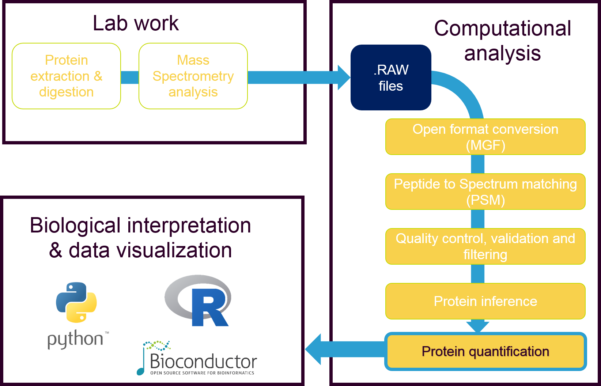

MS-Bay - Bayesian estimation of log2(FC)
============================================


 * [Quickstart](#quickstart)
 * [Introduction](#introduction)
 * [Quantification](#quantification)
 * [Implementation](#implementation)

---


## Quickstart


###  Read data for a full protemics experiment dataset

```
data = pd.read_csv("data/data.tsv", sep = "\t")
data.head(10)
```


#### Instantiate an MsBay object
```
from MSBay import MSbay
msbay = MSBay(data, features)
```

#### Compile a model for 2 (n) peptides
```
model = MsBay.compile_model(n_peptides=2)
```

#### Load the peptides for protein P76397
```
model.load_data("P76397")
```

#### Compute posterior and return an MCMC trace
```
trace = model.compute_posterior(model_name="P76397",n_draws=3000, n_chains=3)
```

SCREENSHOT OF pm.plot_posterior()


## Introduction  

Protein quantification in proteomics is used to better discern how a biological system responds to a specific stimuli at the protein level. It enables the extraction of quantitative information on its protein composition, which could lead to a deeper understanding of many cell processes in which proteins are involved.


Quantification can be achieved by using MS1 intensity measurements as proxy for protein quantities. However, in order to correctly asses the treatment effect i.e the changes in protein quantities due to the actual treatments applied, one needs to factor in the peptide variability and the run (batch) variability.

This module performs label-free relative protein quantification using a simple Bayesian model while accounting for these effects:

  * treat: the effect of the treatment.
  * pep: the effect of the peptide (optionally modeled from sequence).
  * run: the effect of the run (batch).


It implements a linear regression model similar to that from the [MSqRob package](https://github.com/statOmics/MSqRob). While the original MSqRob minimises an OLS loss function with ridge regression and Huber weights, the present program instead runs Monte Carlo-Markov Chain (MCMC) simulations to determine the posterior probability distribution of the model parameters. Once the model parameters are fitted to the data for one protein, the posterior probability of its fold change estimate can be infered.

## Quantification

The tool is a new alternative to the "Protein quantification" step. Current alternatives are 

* MSnBase: An R Bioconductor package performing summarization methods
* MSqRob: An R package implementing a peptide-based model. Supports moFF, MaxQuant and open generic formats.
* MaxLFQ: Part of the MaxQuant suite, performs peptide summarization and least squares regression.
* StPeter: Part of the TPP suite, implements the spectral index method. Only TPP input formats are supported.
* Non-free software: Progenesis QI, Proteome Discoverer, GeneData, etc.

Like MSqRob, this package performs relative quantification, i.e it provides an estimate of the abundance ratio between 2 conditions, but it does not provide an absolute measurement of the quantities on each one. Thus, its results can be regarded as an estimate of the log2FC, or the log2 abundance ratio between the two conditions being compared.




## Implementation


GRAPH_OF_MODEL


The code for the model is contained in `protein_model.py`. It contains the `compute_posterior()` method:

```
def compute_posterior(self, n_peptides, hierarchical_center=False, remove_backend=True, sequence=False):

    """
    Keywords
    
    -shared_variables: np.arrays made into Tensors with theano.shared() storing
        all the data for a single protein
        The data contained in them can be changed with var.set_value()
        for fast fitting of the model to several protens.

    -n_peptides: int, number of peptides modelled. Changes in this
        argument define different models that can be fitted
        to proteins with different number of peptides

    -model_name: string coding the name of the trace and the traceplot

    -n_draws: int. How many draws (sampling) should pymc3 take=?
    -n_chains: int. How many chains should be run in parallel?

    -hierarchical_center: if False, perform reparametrization trick from
    
    -remove_backend=if True, overwrite an existing backend if it exists
    
    -sequence: boolean controlling if the sequence features should be used
        to model the variance across peptides of the same protein
    """
```

The algorithm models the log2fc estimate with 2 linear regressions:

The main GLM is used to predict the quant_value from MS1 based on the effects mentioned above. Other effects may be added, such as fraction.

The secondary GLM, if sequence=True, is built to model pep as a
function of features extracted from either the peptide sequence alone or in combination
with its surroundings in the protein environment.
The environment is defined as the 15 residue window on each side.
The result of this LM is an estimate of the peptide bias for each peptide (2,3,4..)
based on the features

If sequences=False, this estimate is modelled with a simple Normal distribution.

The sequence features passed should be those listed in table 3 from https://www.ncbi.nlm.nih.gov/pubmed/16873510
Table 3 shows the features that best performed while predicting the peptide observability.

This function returns the model object.