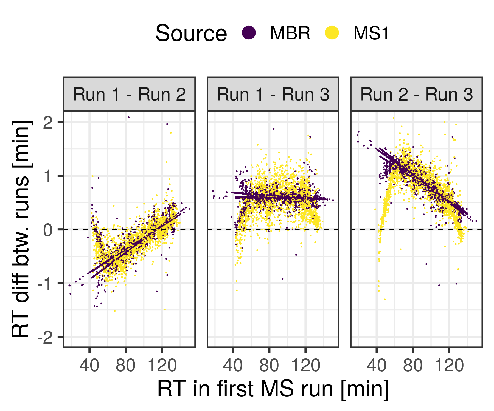

# Pipeline documentation #

 * [Introduction](#introduction)
 * [Minimum Requirements](#minimum-requirements)
 * [Documentation](#documentation)
   - [Working directory](#working-directory)
   - [Load settings](#load-settings)
   - [Create decoy database](#create-decoy-database)
   - [Search spectra](#search-spectra)
   - [Integrate and validate results](#integrate-and-validate-results)
   - [MBR and Apex intensity extraction](#mbr-and-apex-intensity-extraction)
   - [Relative quantification](#[relative-quantification)
   - [Biological inference](#biological-inference)
---

## Introduction ##

This repo provides a complete open source, free and (almost) 100 % Linux supported pipeline for the label-free quantification analysis of .RAW (ThermoScientific) DDA MS spectra files.

It is achieved by performing the main following tasks:

- Search spectra against protein database and find Peptide-to-Spectrum-Matches (PSMs) using one or several search engines.
- Validation and FDR filtering of the search results.
- Match between runs and apex intensity extraction.
- Quantification proper.

The pipeline is powered by some the software kindly made publicly available by [the Computational Omics and Systems Biology (Compomics) group](https://compomics.github.io/) and [the Statistical Omics (Statomics) group](https://statomics.github.io/) at University of Ghent (Belgium). The programs that the pipeline makes use of are:

1. SearchGUI (Compomics, requires Java)
2. PeptideShaker (Compomics, requires Java)
3. moFF (Compomics, requires Python)
4. MSqRob (Statomics, requires R)

** DISCLAIMER: All credit to the awesome functionality, flexibility and easiness of deployment goes to the developers of these tools (not me).** Here it will be showed how I combined them to provide a through analysis from the mgf file to protein identifications and quantities.


## Minimum requirements ##

* Java version 1.8.0
* Python 3.5
* R 3.4.4
* Linux environment (Bash available)


## Documentation ##

In this section we will go through the bash scripts implementing the pipeline


 
### Working directory ###

The software is designed to work under the following directory structure:

```
/$ROOT_DIR/$EXP_NAME/
## tree output required
```
 
 
### Load settings ###

The analysis of MS data requires the declaration many experimental variables that customize how the algorithms are to be run. For example:

+ (*Required*) **Cleaving enzyme**: describes the sequence specificity of the enzyme used to cleave whole denaturalized proteins into peptides. Integrate and validate results
+ **Missed cleavages**: how many target sequences of the enzyme are allowed to be left without cleaveged (i.e. missed by the enzyme).
+ (*Required*) **Reference protein database**: set of proteins that the spectra will be tried to be matched to.
+ **Variable/Fixed peptide modifications**: cuztomize residual weights to take into account a possible experimental.
+ **Peptide and fragment tolerance**: error/inaccuracy allowed between measured and theoretical m/z, at the MS1 (peptide) and MS2 (fragment) levels. 
+ etc*

These settings can be declared in a `pipeline_settings.txt`file with the following format:

```
## pipeline_settings.txt
# for unique values
setting:value
# for lists of values (database_names and search_engines)
setting:value1, value2
```

The settings are then loaded running

```
./load_flags.sh <$ROOT_DIR> <$EXP_NAME> </full/path/to/pipeline_settings.txt>
```

where `$ROOT_DIR` should be replaced by the full path to a directory to work at and `$EXP_NAME` is the name (relative path from `$ROOT_DIR`) of an empty folder residing in it. `$EXP_NAME`will store all files produced in the analysis of each experiment. This pair of variables are used to identify our dataset and distinguish it from other datasets that can be analyzed in a similar way.

The command loads the experimental settings as bash variables. Some utility bash functions are loaded too. 

After that, the user can run

```
./create_settings_file.sh <$ROOT_DIR> <$EXP_NAME>
```

which will create a human readable .txt file containing these key-value pairs in a format that's also compatible with the java programs called downstream. The file is created using the `IdentificationParametersCLI` available as part of the SearchGUI utility. The settings are provided with a command line interface (CLI) where pair of setting-value are provided. These pairs are extracted from the `pipeline_settings.txt`file defined above.

A full list of the settings that can be defined and a comprehensive guide on `IdentificationParametersCLI`is available at [https://github.com/compomics/compomics-utilities/wiki/IdentificationParametersCLI](https://github.com/compomics/compomics-utilities/wiki/IdentificationParametersCLI)

### Create decoy database


#### Why a decoy database is needed
Searching MS spectra against a proteome database will return many hits. Unfortunately, many of them could be wrong, i.e spurious peptide-to-spectrum matches (PSMs) where the peptide that generated the registered spectrum is not the same as the one the spectrum is matched to. In order to take this into account, hits are provided a score, similar to what BLAST does with sequence alignments.

A score is high or low in comparison with the score registered by hits of the same spectrum to other peptides in the database. Even if a score is provided, it is very difficult to assert whether a specific hit is a true hit or a mistake, because in principle, we don't know what constitutes a 'high' enough score.

However, thanks to statistics, it is straightforward to estimate with fairly high precission how many false hits are there within a sufficiently large group of supposedly true hits. One method to achieve this is via the creation of a *decoy database*.
A decoy databse consists of a "fake" version of the original reference database (target database) that is used to estimate the false discovery rate (FDR) among the results. It works as a negative control, where we know the ground truth of the PSM status. It's a fake database, therefore, the proteins in it don't exist and any matches to them are definitely random matches.

Many algorithms are available to produce them, most frequently a simple reversal of the protein sequences will do.
This way, the entry:
```
>sp|PHAPPY|HAPPY_PROTEIN
VIVALAVIDA
```

becomes

```
>sp|PHAPPY|DECOY_HAPPY_PROTEIN
ADIVALAVIV
```

Since the decoy database still has identical properties to the reference (target) databse (aminoacidic composition, protein length distribution, etc), the distribution of the score of the hits to the decoy can be assumed to be similar to the distribution of the false hits to the target, providing a straightforward way to estimate the confidence in the hits to the target.
For exampe, if we get 10 hits to the target database with score greater than s, and there's 3 hits to the decoy also with score greater than s, we can assume that 10 of our hits to the target are false.

#### How to make the decoy database


```
./create_decoy_database.sh <$ROOT_DIR> <$EXP_NAME>
```
this requires the existence in the `/$ROOT_DIR $EXP_NAME/databases/` folder of .fasta files with the names declared in the *pipeline_settings.txt* file (without extension, i.e mydatabase.fasta should be declared as mydatabase in the file. All .fasta files will be made into a single `all.fasta` file from which the decoy database will be obtained. As a result, a target and decoy database will be available in at `/$ROOT_DIR $EXP_NAME/databases/`.

### Search spectra

**Input**

1. MGF files.
2. Target and decoy databases in .fasta format.

**Output**
1. One zip file per spectra file, stored under `$ROOT_DIR/$EXP_NAME`.

**Detail**
Proper analysis of the MS data starts with the matching of the spectra to the database, producing  **P**eptide-to-**S**pectrum **M**atches (**PSM**s). The goal of this step is to find the peptide within the list of proteins in the database (fasta file) that produced each of the recorded spectra. Many algorithms are available implementing motley strategies. The most broadly used ones are:

* [MASCOT](http://www.matrixscience.com/)
* [MS-GF+](https://github.com/MSGFPlus/msgfplus)
* [MS-Amanda](http://ms.imp.ac.at/?goto=msamanda)
* [Andromeda (MaxQuant)](http://www.coxdocs.org/doku.php?id=maxquant:andromeda)
* [Comet (Trans Proteomic Pipeline, TPP)](http://comet-ms.sourceforge.net/)
* [Tide](https://noble.gs.washington.edu/proj/tide/)

Many of these search engines are supported by SearchGUI under Linux. SearchGUI provides a unified interface to each search engine, whereby the different programs in the command is as simple as passing a yes/no flag. Moreover, the results produced by each engine can be combined for more robust analysis i.e mistakes commited with the strategy implemented by one search engine can be fixed with a complementary strategy implemented in another engine.

**Call**


```
./search_all_mgf.sh <$ROOT_DIR> <$EXP_NAME> [$FILTER]
```

Running this command will trigger a call to SearchGUI with the search engines and general settings declared in `pipeline_settings.txt`. Spectra files are recommended to be placed under `$ROOT_DIR/$EXP_NAME/data/mgf/`. Only mgf files are supported. The output will consist of a zip file containing results of the search, the database and the spectra file, one zip file for each spectra file. This behaviour and many others can be customized with the `-output_data` flag as explained in [https://github.com/compomics/searchgui/wiki/SearchCLI](https://github.com/compomics/searchgui/wiki/SearchCLI).

* As it stands, once all the searches are over, it will call the next script in the pipeline, `call_peptide_shaker.sh`. 

### Integrate and validate results

**Input**

1. SearchGUI zip files.

**Output**

1. PSM reports in a tabular format, compatible with moFF. Stored under `$ROOT_DIR/$EXP_NAME/peptideShaker_out/reports/PSM_reports/`. Every row represents the best PSM passing the validation filters, for each given spectrum.
2. .cpsx file containing the PeptideShaker project that can be opened for posterior checking.
3. Optionally, graphics describing the dataset.

**Detail**

SearchGUI zip files can be passed to PeptideShaker to perform the following tasks

1. Validate the target hits using the results of the decoy search. Default filter is 1% FDR i.e only target hits with less than 1% FDR are kept.
2. Export results to a table format compatible with downstream programs.
3. If > 1 search engine was used, PeptideShaker can combine their output.
4. If the GUI is launched, PeptideShaker provides awesome data visualizations that give great insights into the dataset.

**Call**

```
./call_peptide_shaker.sh $ROOT_DIR $EXP_NAME
```
### MBR and Apex intensity extraction

**Input**

1. Original .RAW files.
2. Default PSM report produced by PeptideShaker.

**Output**

1. Table with format similar to Default PSM reports but now including MBR matches and refined intensity measurements.
2. `peptide_summary_intensity_moFF_run.tab` consisting of a table where every ith row contains information for the ith peptide. The first column contains its sequence, the second the protein it is matched to and the jth column contains the apex intensity registered in sample j-2. Samples are ordered using the default ls ordering, using the filename of the mgf file.

**Detail**

[moFF](https://github.com/compomics/moFF) (**mo**dest **F**eature **F**inder) is a very convenient tool that performs two tasks:

1. **M**atch **B**etween **R**uns (**MBR**) whereby the software attempts to successful identifications between replicate runs. This is useful if the same peptide could be identified in two replicates but not the third one, due to noise in the fragmentation pattern for example. If a spectrum with unknown identity shares the same retention time and precursor mass as spectra in replicate runs where the identification was successful (and similar to one another), then it makes sense to guess that the unknown identity will actually be the same as in the other two. This trick can be used to increase the number of identifications and decrease the number of missing datapoints in the dataset (more concretely MAR and MCAR, but not MNAR).

2. Apex Intensity extraction, where the program looks at the elution profile of the same peptide over retention time to extract the peak intensity, i.e the maximum intensity registered for the peptide. This makes the intensity measurement less noisy and more consistent, providing a more robust dataset if intensity based quantification is to be performed.



**Call**

```
./call_moff.sh $ROOT_DIR $EXP_NAME
```

### Relative quantification

**Input**


* A `peptide_summary_intensity_moFF_run.tab` file created by moFF.
* A `experimental_design.tsv` file storing the sample organisation
* Several flags to fine tune the behaviour: which contrast to test, etc.

**Output**

A `RSqM_signif` file saved to the default export folder. It is a table with the following fields:

- estimate (robust estimate of the log2FC of a contrast)
- se (standard error of the estimate)
- df (degrees of freedom)
- Tval (value of the student's t statistic)
- pval (p-value of the test)
- qval (corrected pvalue)
- signif (true if qval is less than 0.05)
- Protein.IDs (protein ids of the group)


**Detail**

Reads moFF-like output in a peptide_summary_intensity_moFF_run[_SUFFIX].tab and the experimental design in `exp_name/data/experimental_design.tsv`.
Returns a robust estimation of the log2(FC) for as many proteins as possible, together with test statistics

This table can be fed to proteomic_analysis.R to create a volcano plot and perform gene set enrichment analysis

If the `--fraction_normalized` flag is passed, the moFF file is assumed to be produced by `aggregate_fractions` and not moFF itself.
This means that the experimental annotation needs to be edited to remove the fractions
The value of the `--suffix` is a string appended to the RSqM_signif filename
If `--save_model` the session is saved to the export folder, set by default to the quantification folder of the experiment


The script makes use of the MSqRob package for robust protein quantification of MaxQuant/moFF output.
In turn this package makes use of the data structures implemented in the MSnBase package (MSnSet data).

It works by:

1. Importing the data with `import2MSnSet`.
2. Preprocess with `preprocess_MSnSet`.
3. Compile to a protdata object (implemented in MSqRob).
4. Fit a ridge regression model with Huber weights and empirical bayes estimation of the variance (robust regression).
5. Build a contrast matrix and perform hypothesis testing with `test.protLMcontrast`.
6. Adjust results for multiple testing with `prot.p.adjust`.

**Call**

`nohup Rscript scripts/R/moff_to_msqrob.R --root_dir `pwd` --exp_name maxlfq --moff_file peptide_summary_intensity_moFF_run.tab --sample_filter "" --experiment_contrasts conditionH-conditionL --save_model --suffix "" [--fraction_normalized] &`

### Biological inference

**Input**


1. RSqM_signif.tsv file created by moff_to_msqrob.R 

**Output**

Plots

1. Volcano plot showing for every protein group:
  -on the x axis the value of the estimated log2FC
  -on the y axis the value of the -log10 p-value

2. Histogram showing the estimate distribution
 -Lists of up-regulated and down-regulated proteins.
 -List of proteins with significant change but beneath the log2fc_threshold.
 -List of proteins for which the estimate could not be computed. This is due to most peptides being missing in all replicates of one of the conditions of the contrast
  
3. Plots and summary statistics

**Detail**


Reads MSqRob output from `exp_name/quantification/RSqM_signif.tsv` and performs differential abundance analysis, Protein Set Enrichment Analysis (PSEA, similar to GSEA) and creates a volcano plot.


**Call**
`nohup Rscript scripts/R/proteomic_analysis.R --root_dir `pwd` --exp_name maxlfq --suffix "" --log2fc_threshold 1 &`